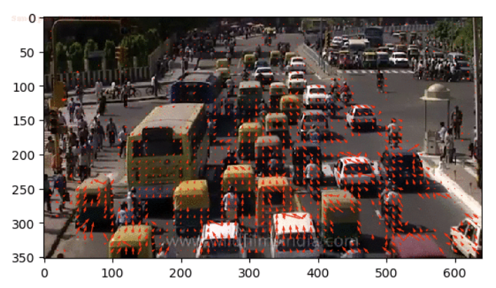
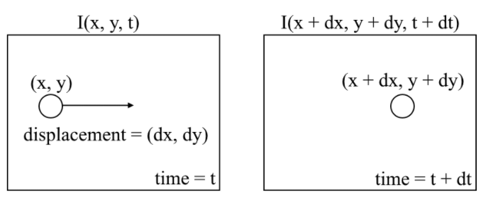
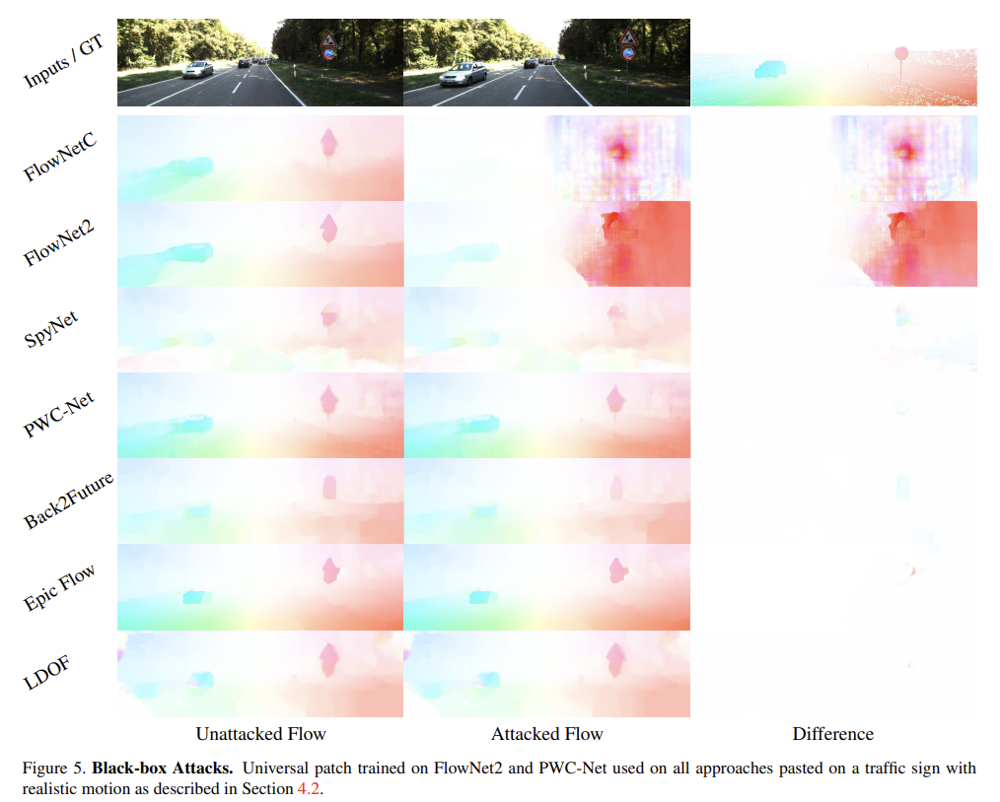

# Optical Flow Playground (educational project)

## Description

The main goal of this repo is to learn the Optical Flow task. It includes: 
- task overview
- research of existing approaches
- results reproducing
- practice in Attacking Optical Flow

## Optical Flow - an Overview Notes

**Optical Flow Estimation** is the problem of finding pixel-wise motions between consecutive images.

Sparse optical flow of traffic             |  Optical flow problem
:-------------------------:|:-------------------------:
  | 

[ [images source](https://nanonets.com/blog/optical-flow/), [paperswithcode page](https://paperswithcode.com/task/optical-flow-estimation) ]

## Tested approaches 

- FlowNet2: [paper](), [source code](https://github.com/NVIDIA/flownet2-pytorch)
- RAFT: [paper](https://arxiv.org/pdf/2003.12039.pdf), [source code](https://github.com/princeton-vl/RAFT)
- GMA: [paper](https://arxiv.org/pdf/2104.02409.pdf), [source code](https://github.com/zacjiang/GMA)

## Attacking Optical Flow

Implementation of a patch with noise or other content into frames can break the process of optical flow estimation. 

This approach includes patches with a default value or the content of the patch is determined by the optimization problem. This customizes the patch and improves the results.

Example of attacks from [Attacking Optical Flow](https://openaccess.thecvf.com/content_ICCV_2019/papers/Ranjan_Attacking_Optical_Flow_ICCV_2019_paper.pdf) paper:

## Results

TODO

## Conclusions

TODO
